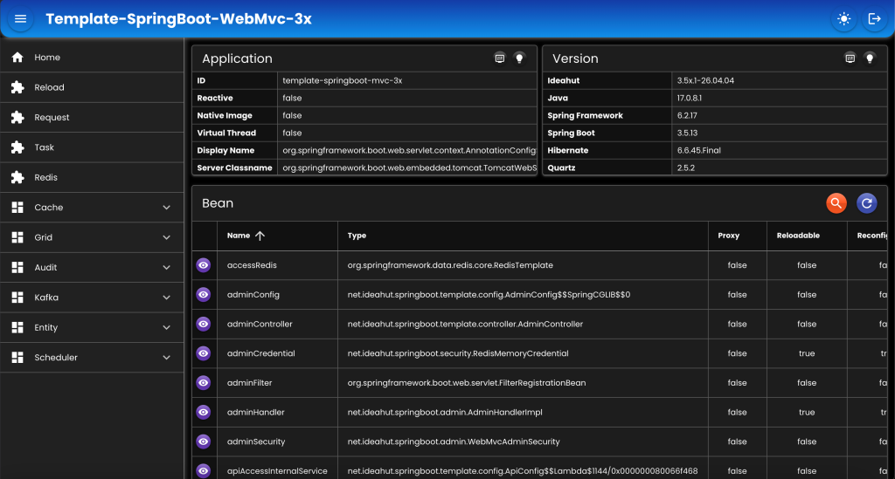

# Template SpringBoot WebMvc 3x&nbsp;&nbsp;&nbsp;

### [Dokumentasi](https://github.com/ideahut-apps-team/Ideahut-Spring-Boot)

##

|Artifact|Spring Boot|
|:---------:|:----------:|
|__ideahut-springboot-3x__|<small>(wajib di semua spring boot versi 3)</small>|
|ideahut-springboot-3.0x.1|__3.0.0 - 3.0.3__|
|ideahut-springboot-3.0x.2|__3.0.4 - 3.0.13__|
|ideahut-springboot-3.1x.1|__3.1.0 - 3.1.12__|
|ideahut-springboot-3.2x.1|__3.2.0 - 3.2.12__|
|ideahut-springboot-3.3x.1|__3.3.0 - 3.3.13__|
|ideahut-springboot-3.4x.1|__3.4.0 - 3.4.13__|
|ideahut-springboot-3.5x.1|__3.5.0 - 3.5.13__|

##

### Untuk mencoba versi Spring Boot tertentu:
* Rename pom-3.xx.x.xml menjadi menjadi __pom.xml__.
    ```yaml
    pom-3.0x.1.xml
    pom-3.0x.2.xml
    pom-3.1x.1.xml
    pom-3.2x.1.xml
    pom-3.3x.1.xml
    pom-3.4x.1.xml
    pom-3.5x.1.xml
    ```
* Pastikan artifact yang digunakan sesuai dengan versi Spring Boot (lihat tabel artifact di atas).
* Edit file __pom.xml__ dengan mengubah versi __'spring-boot-starter-parent'__ sesuai dengan versi yang diinginkan.
    ```xml
    <parent>
		<groupId>org.springframework.boot</groupId>
		<artifactId>spring-boot-starter-parent</artifactId>
		<version>3.5.13</version> <!-- Ubah bagian ini -->
		<relativePath/>
	</parent>
    ```

##

### Untuk mencoba database tertentu:
* Ubah properties __'spring.profiles.active'__ sesuai dengan database yang diinginkan.
    ```yaml
    spring:
        profiles:
            #active: "db2"
            #active: "derby"
            #active: "h2"
            #active: "hsql"
            #active: "mariadb"
            active: "mysql"
            #active: "oracle"
            #active: "postgresql"
            #active: "sqlserver"
    ```
* Edit file __'application-{profile}.yaml'__, pastikan host, port, username, dan password sesuai dengan server database yang digunakan.
    ```yaml
    application-db2.yaml
    application-derby.yaml
    application-h2.yaml
    application-hsql.yaml
    application-mariadb.yaml
    application-mysql.yaml
    application-oracle.yaml
    application-postgresql.yaml
    application-sqlserver.yaml
    ```
* Aktifkan __dependency__ driver di __pom.xml__. Contoh: jika menggunakan PostgreSQL, maka aktifkan bagian ini:
    ```xml
    <!-- POSTGRESQL -->
    <!--
    <dependency>
        <groupId>org.postgresql</groupId>
        <artifactId>postgresql</artifactId>
    </dependency>
    -->
    ```
* Beberapa __dependency__ tidak diaktifkan, agar proses _build_ __Native Image__ tidak terlalu lama dan tidak mengkonsumsi memori terlalu besar.

##

### Membuat Native Image
* Download GraalVM dari salah satu tautan berikut:
    * [GraalVM](https://www.graalvm.org/downloads/)
    * [Bellsoft](https://bell-sw.com/pages/downloads/native-image-kit/)
    * [Mandrel](https://github.com/graalvm/mandrel/releases)
* Setup environment variable, seperti berikut:
    ```shell
    export GRAALVM_HOME=/Library/Java/JavaVirtualMachines/aarch64/bellsoft-liberica-vm-full-openjdk25-25.0.1/Contents/Home
    export JAVA_HOME=$GRAALVM_HOME
    export MAVEN_HOME=/opt/macdev/maven/3.9.9
    export PATH=$PATH:$GRAALVM_HOME/bin:$MAVEN_HOME/bin
    ```
* Masuk ke directory project.
    ```shell
    cd ./Template-SpringBoot-WebMvc-3x
    ```
* Compile [AOT](https://docs.spring.io/spring-boot/reference/packaging/native-image/introducing-graalvm-native-images.html)
    ```shell
    mvn \
    -Dspring.aot.enabled=true \
    -Dmaven.compiler.target=25 \
    -Dmaven.compiler.source=25 \
    -Djava.version=25 \
    clean compile spring-boot:process-aot package
    ```
* Mengumpulkan metadata untuk __Native Image__.
    ```shell
    $JAVA_HOME/bin/java \
    -Dspring.aot.enabled=true \
    -agentlib:native-image-agent=config-merge-dir=./src/main/resources/META-INF/native-image \
    -jar target/Template-SpringBoot-WebMvc-3x-1.0.0.jar
    ```
* Menggabungkan _serialization_ ke metadata.
    ```shell
    $JAVA_HOME/bin/java -cp target/Template-SpringBoot-WebMvc-3x-1.0.0.jar \
    -Dloader.main=net.ideahut.springboot.template.config.NativeConfig \
    org.springframework.boot.loader.launch.PropertiesLauncher
    ```
* Membuat __Native Image__.
    ```shell
    mvn \
    -Dspring.aot.enabled=true \
    -Dmaven.compiler.target=25 \
    -Dmaven.compiler.source=25 \
    -Djava.version=25 \
    clean native:compile -Pnative -X
    ```
##

### Admin
- `URL`  : http://localhost:5402/_/web
- `User` : admin
- `Pass` : password
<div align="left">
   
</div>

##

### Template

* [Springboot 3x WebMvc](https://github.com/ideahut-apps-team/Template-SpringBoot-WebMvc-3x)
* [Springboot 3x WebFlux](https://github.com/ideahut-apps-team/Template-SpringBoot-WebFlux-3x)
* [Springboot 2x WebMvc](https://github.com/ideahut-apps-team/Template-SpringBoot-WebMvc-2x)
* [Springboot 2x WebFlux](https://github.com/ideahut-apps-team/Template-SpringBoot-WebFlux-2x)